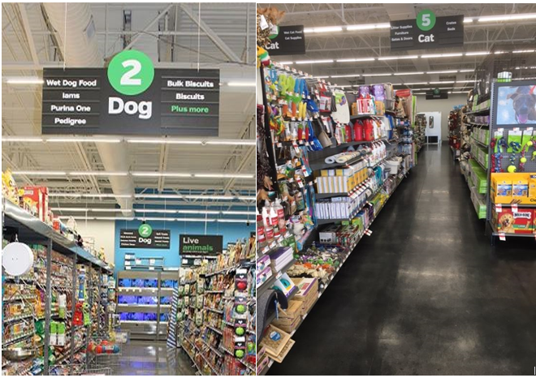
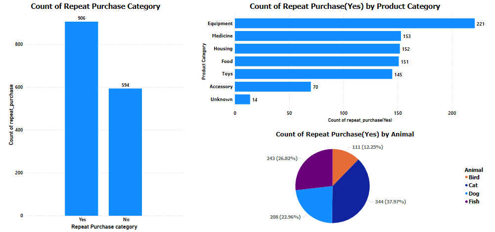
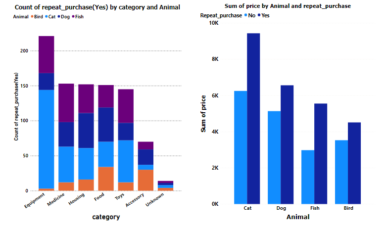
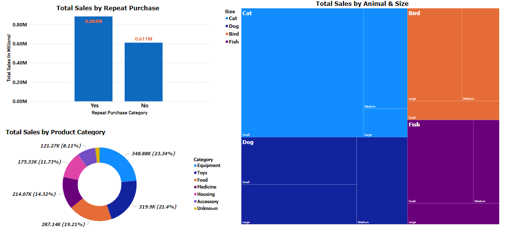
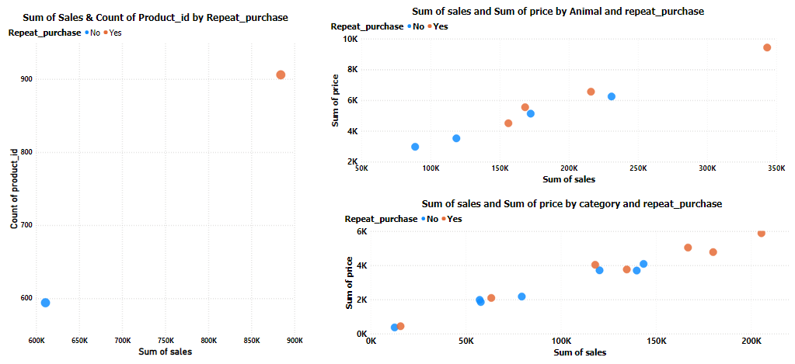

# PetMind Retail Stores – Sales Analysis



[Photo Credit](https://www.google.com/url?sa=i&url=https%3A%2F%2Fwww.petsuppliesplus.com%2Fstore%2Fva%2Fmanassas%2F4131-manassas%2F4131&psig=AOvVaw2uSccLxLbVaOLUiV8Fl8T_&ust=1681957241333000&source=images&cd=vfe&ved=0CBMQjhxqFwoTCOiQ05HxtP4CFQAAAAAdAAAAABAR)

## Introduction
This Power BI project is on Sales Analysis of a fictitious retail store for pet products, **PetMind**.  It sells products that are a mix of luxury items and everyday items. Luxury items include toys. Everyday items include food. To increase sales, the company used an approach that involved sales of more everyday products repeatedly. Having tested this approach for the last year, PetMind currently wants a report on how repeat purchases impact sales. Analyst-Joan is poised to analyse and present the report of derived insights, which will enable the store make profitable data-driven decision.

## About the Data
The dataset is a CSV file that contains one table, consisting of 1500 rows and 8 columns of the sales records in the **PetMind stores** for the last year. The data was gotten from [Here](https://s3.amazonaws.com/talent-assets.datacamp.com/pet_supplies_2212.csv).   

## Business Question
1.	How many products are repeat purchases?
2.	Which category of the repeat purchases has the most observations?
3.	Are the observations balanced across categories of the repeat purchases?
4.	Describe the distribution of all of the sales. 
5.	Describe the relationship between repeat purchases and sales. 


## Power BI Skills/Concepts applied:
-	Cleaning/Validation in Power Query
-	DAX Concepts: Calculated Measure.
-	Data Visualization

## Data Modelling
_This was not applicable as the dataset has only one table._


## Data Cleaning/Validation in Power Query
The dataset was imported into Power BI’s Power Query for data validation and cleaning.  The first thing I did was to change the column profiling from ‘based on Top 1000 rows’ to ‘based on entire dataset’. The original dataset contains **1500 rows and 8 columns**. ‘Column quality’ and ‘Column distribution’ checkbox was selected to get a summary information about each column for effective validation. Here is how I validated each column:

-	**Product_id:** It’s a unique identifier and had 1500 distinct values just as expected. 


-	**Category:** It had 7 distinct values, instead of 6. Column profiling was checked, and it showed the 7th distinct value was a hyphen (-), suggesting missing value. The 25 rows having the hyphen (-) / missing values were then replaced with “Unknown” as required.	

-	**Animal:** It had 4 distinct values – Cat, Dog, Bird, and Fish. This is what was expected.


-	**Size:** It had 9 distinct values, instead of 3. Column profile showed that this was due to spelling variations, where the sizes were written in 3 different ways – Uppercase, lowercase and first letter capitalization. The rows with first letter capitalization case for each category were retained, while the others were replaced to have first letter 	capitalization. For instance, ‘small’ and ‘SMALL’ were replaced with Small.


-	**Price:** It had 707 distinct values and 376 unique values, suggesting presence of duplicates. This may be as a result of 2 or more products having the same price. The team providing the data should be consulted for confirmation. Column profiling also showed that there were 150 rows that had the text, ‘unlisted’ within it. I duplicated the price column, replaced the text, ‘unlisted’ with nothing to make it empty, changed the column type to decimal, and then calculated the median from ‘Statistics’ section of the Transform tab. These rows in the original column were replaced with the calculated overall median price (28.06) as per description. The datatype was also changed to decimal and rounded to 2 decimal places and the duplicate column was deleted.

-	**Sales:** It had 1476 distinct values and 1453 unique values, suggesting presence of duplicates. This is may be as a result of 2 or more products being sold at the same price. The team providing the data should be consulted for further confirmation.

-	**Rating:** It had 10 distinct values; however, ‘NA’ was included in 10% of the records (150 rows). Such rows were replaced with ‘zero (0)’. It also had a wrong datatype – ‘Text’, which I changed to whole number.

-	**Repeat_Purchase:** It had 2 distinct values – 1 and 0, as expected. However, for ease of understanding during visualization, the datatype was changed to ‘Text’, ‘1’ was replaced with ‘Yes’ and ‘0’ replaced with ‘No’, based on its representation in the description table. Similarly, since the focus is on the positive repeat purchases (i.e. ‘Yes’ category), A calculated measure was created to isolate the ‘Yes’ options from the ‘No’. This is shown below
```
Count of repeat_purchase(Yes) = 
CALCULATE(
    COUNTA('DAA_pet_supplies_2212'[repeat_purchase]),
    'DAA_pet_supplies_2212'[repeat_purchase] IN { "Yes" }
)

```

_No rows were removed, hence the data still had **1500 rows and 8 columns** after validation and cleaning._


## Data Discovery and Visualization in Power BI

I started by checking the count of repeat purchases and how they are spread across the categories. 

There are six (6) known product categories and one (1) missing/unknown category in the dataset. Based on the visualization below, we can see that 594 products were not repeat purchases while 906 (60.4%) of the 1500 products were repeat purchases, indicating that there are more repeat purchases than not. 




Exploring across the categories, we see that products for Cats had the highest record of repeat purchases. There is also a wide range of difference between the Equipment category, which has the highest record of repeat purchases, with 221 products and the record of repeat purchases in the Accessory category, indicating a likelihood of an imbalance in repeated purchases across the products.
From the observation from the preceding visualization, two questions that comes to mind are these: 
-	_Which type of Animal/Pet product has the highest impact on the product category [Equipment], which has the highest record of repeat purchases?_
-	_Is low Price a determinant in making Cats account for the highest record of repeat purchases among the Animal/pet category?_




From the Visual above, we can now see that the highest repeat purchases within the Equipment category are products for Cats. Also, the price of repeat purchases for Cat-related products are seen to be higher than where no repeat purchases was recorded. _Could this outcome be as a result of PetMind having more of Cat-lovers as their Customers? :thinking: – We are unable to state that as a fact due to limitation of the information we currently have within the dataset. A customer profiling survey may be needed to ascertain that.


### Description of the distribution of all Sales

Understanding the sales distribution across categories is necessary, to enable PetMind team evaluate their effort in attempting to increase the sales of their Pet products. Based on the available data we can determine how sales were distributed across categories.



Based on the Visuals above, we can see that products with repeat purchases have significantly higher sales in total than those without. Although, products for Cats also had the highest total sales, there seems to be a trend of products for Animals of Small size having highest amount of total sales with the Bird category being the only exception. Also, the Equipment category recorded the highest total sales within the product category. With these observed patterns in the sales distribution, PetMind will need further analysis to ascertain if they are due to high demand of such category leading to a consequent high supply, or high rating of the products leading to more recommendations.

### Relationship Between Repeat Purchases and Sales

From previous visuals, we saw that products with repeat purchases had higher sales than those without. Let’s take a step further to examine the relationship between repeat purchases and sales.



From the Plot above, we can see that repeat purchases had a positive impact on sales, as each instance of repeat purchase had a higher sales amount than the ones not in repeat purchase. Hence, we can draw the conclusion that there is a positive relationship between repeat purchases and Sales.

## Key Insights:

-	The Equipment category and products for cats accounted for the highest number of repeat purchases and sales.

-	The sales distribution shows a wide variation in the difference between categories with the highest repeat purchase & total sales amount and categories with lowest records.

-	There is a positive between repeat purchases and sales.

## Recommendations:
Although the strategy of repeated sales of their Pet products by the PetMind team appears to lead to increased sales, we would recommend the following:

-	PetMind team should carry out an internal audit of the quantity of products with lower sales to find out if low supply is a factor that affects their re-purchase. This can also help to narrow the gap in the Sales distribution of the products

-	The team should also consider carrying out a customer profiling survey and further analysis to ascertain factors that determine high repeated purchase of certain Pet products over others and/or no re-purchase by the customers.

